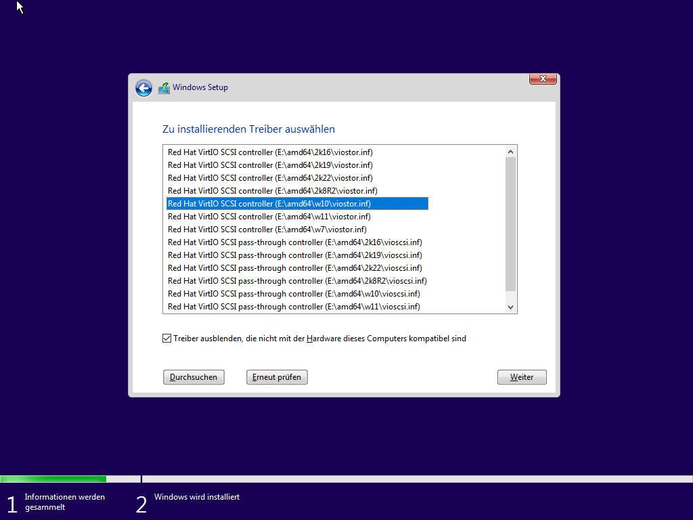

## Creating a VM

Requirements:

* [Windows iso file](https://www.microsoft.com/software-download/windows10ISO)
* [virtio drivers](https://fedorapeople.org/groups/virt/virtio-win/direct-downloads/stable-virtio/virtio-win.iso)

All of the following `exports` commands set environment variables to change the behavior of the `virt-install` call. Adjust them according to your needs.

```bash
#### CONFIG BEGIN #####
# Memory assigned to the vm. This example uses 90% of the available memory. A simple number in megabytes is also sufficient
export MEMORY_M=$(echo $(($(free -m | grep Mem: | awk '{print $2}') * 0.9)) | awk '{print int($1+0.5)}')
# Size of the disk image in gigabyte
export IMAGE_SIZE_G="100"
export IMAGE_PATH="win10.qcow2"
# Path to the virtio driver iso
export VIRTIO_ISO_PATH="virtio-win.iso"
# Path to the Windows iso file
export WIN_ISO_PATH="Win10_21H2_German_x64.iso"

# Network configuration. Delete the one you don't use
# NAT Network
export NETWORK_TYPE="default"
# Bridge Network
export NETWORK_TYPE="bridge=br0"

export VM_CORES=12
export VM_THREAD_PER_CORE=1

#### CONFIG END #####

export VM_NUM_CPUS=$((${VM_CORES}*${VM_THREAD_PER_CORE}))

virt-install --connect qemu:///system \
--virt-type kvm \
--name=windows10 \
--os-variant=win10 \
--vcpus ${VM_NUM_CPUS},sockets=1,cores=${VM_CORES},threads=${VM_THREAD_PER_CORE} \
--cpu host-passthrough \
--memory ${MEMORY_M} \
--features smm.state=on,kvm_hidden=on,hyperv_relaxed=on,hyperv_vapic=on,hyperv_spinlocks=on,hyperv_spinlocks_retries=8191 \
--clock hypervclock_present=yes \
--disk path=${IMAGE_PATH},size=${IMAGE_SIZE_G},format=qcow2,sparse=true,bus=virtio,cache=writethrough,discard=unmap,io=threads  \
--controller type=scsi,model=virtio-scsi \
--graphics spice \
--video model=qxl,vgamem=32768,ram=131072,vram=131072,heads=1 \
--channel spicevmc,target_type=virtio,name=com.redhat.spice.0 \
--channel unix,target_type=virtio,name=org.qemu.guest_agent.0 \
--network ${NETWORK_TYPE} \
--input type=tablet,bus=virtio \
--metadata title='Win10' \
--disk ${VIRTIO_ISO_PATH},device=cdrom \
--cdrom ${WIN_ISO_PATH}
```

A window with the VM should automatically open. If this is not the case or the window is closed by accident just run

```bash
virt-viewer -c qemu:///system
```

Closing the viewer window does not stop the VM.

### Setup of Windows client

Notice: If you are using a nested VM-Setup the mouse might act strange in Windows. If that is the case just install using the keyboard only. After installing the virtio drivers, everything will work as expected.

1. The installation doesn't differ from installing on a physical machine. Only during the partitioning it is necessary to load the virtio drivers from the mounted disk as seen below:
    

1. After the installation the VM can be started using the following command

    ```bash
    virsh --connect qemu:///system start windows10
    ```

1. Once Windows is booted, navigate to the mounted virtio drive and run `virtio-win-guest-tools.exe`. After installing those files higher resolutions and other features are available.
Make sure you use at least version `0.1.217`.

1. In the final step check the device manager for missing or corrupted drivers. If anything is wrong uninstall and reinstall them again.

